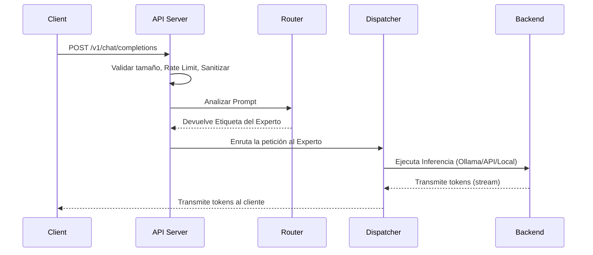
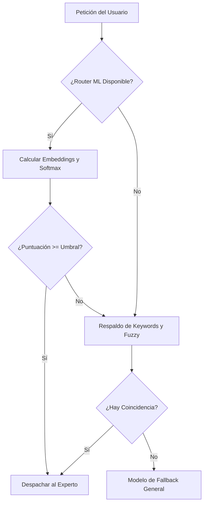
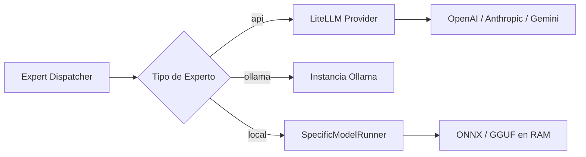

# Arquitectura del Sistema

l3mcore está diseñado como un sistema middleware modular. Se sitúa entre las aplicaciones cliente y los modelos de IA reales.

## Flujo de Alto Nivel

1. **Petición del Cliente**: HTTP al servidor API de l3mcore
2. **Seguridad y Validación**: validación de tamaño, rate limit, sanitización
3. **Enrutamiento**: el Router analiza el prompt y determina el experto
4. **Despacho**: el Expert Dispatcher reenvía al backend correcto
5. **Respuesta**: streaming directo al cliente

---

## El Motor de Enrutamiento (3 niveles)

### Nivel 1: Machine Learning (Principal)

Usa embeddings de texto con `SentenceTransformers` para convertir prompts en vectores matemáticos y compararlos con cada experto.

**Sistema de Puntuación Híbrido** (por experto):
- Pre-calcula vectores individuales de cada keyword
- Pre-calcula el centroide normalizado de todas las keywords  
- Pre-calcula el vector de la descripción del experto

En cada petición, compara el prompt contra estos vectores con 4 señales:

| Señal | Peso por defecto | Qué mide |
|---|---|---|
| `max_keyword` | 40% | Máxima similitud con cualquier keyword individual |
| `description` | 30% | Similitud con la descripción del experto |
| `mean_keyword` | 20% | Similitud media con todas las keywords |
| `top3_vote` | 10% | Consenso: fracción de top-3 keywords sobre umbral 0.4 |

Las puntuaciones se normalizan con **Softmax** para obtener una distribución de probabilidad real.

### Nivel 2: Respaldo de Keywords y Fuzzy

Si el ML no está disponible o la puntuación es inferior al `confidence_threshold`, usa `rapidfuzz`:

- **Solapamiento exacto de tokens**: palabras idénticas
- **Fuzzy matching**: coincidencia parcial para errores tipográficos o conjugaciones

### Nivel 3: Fallback General

Si nadie supera el umbral de fallback, la petición va al modelo designado como `"fallback": true` en `experts.json` (normalmente un modelo de propósito general).

---

## El Expert Dispatcher

El Dispatcher abstrae la complejidad de cada backend e instancia el runner correcto según el `type` del experto.
