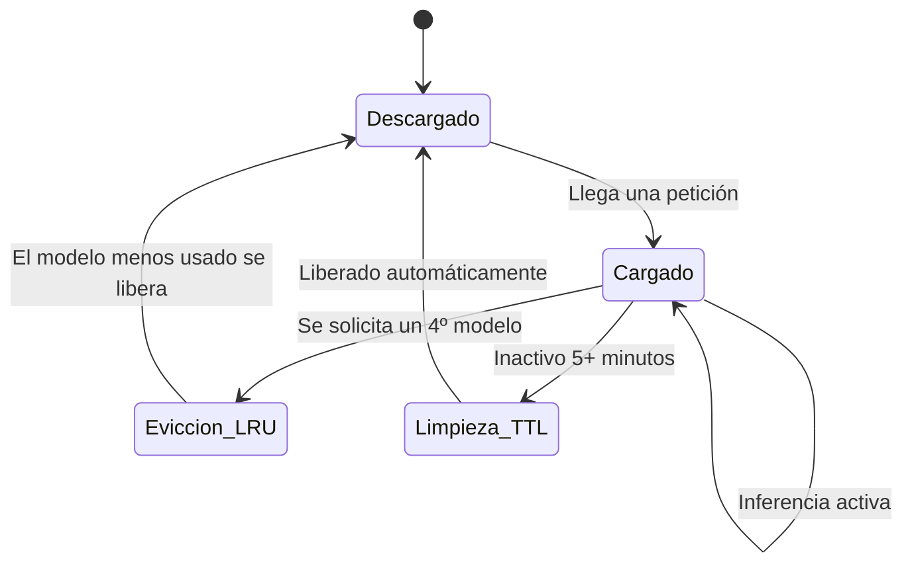

# Gestión de Memoria

Para modelos locales (`type: "local"`), LEMoE implementa un gestor de memoria automático que evita el agotamiento de RAM.

## Ciclo de vida de un modelo



## Límite máximo de modelos cargados

Por defecto, máximo **3 modelos locales** en RAM simultáneamente.

```python
# modules/onnx_runner.py
MAX_LOADED_MODELS = 3
```

Si una petición requiere un 4º modelo y los 3 slots están ocupados, el **Least Recently Used (LRU)** se descarga para liberar espacio.

## TTL (Time To Live)

Un hilo de limpieza en segundo plano supervisa el uso. Si un modelo lleva **5 minutos sin recibir peticiones**, se descarga automáticamente.

```python
IDLE_TIMEOUT = 300  # segundos (5 minutos)
```

## Restricción de hilos ONNX

Por defecto, cada sesión ONNX está restringida a:
- **2 hilos intra-op** (dentro de una operación)
- **1 hilo inter-op** (entre operaciones)

Esto es intencionalmente bajo. Si cada modelo usara todos los núcleos del CPU y hubiera 3 modelos activos simultáneamente, el context-switching colapsaría el rendimiento general.

## Ajuste de parámetros

En `modules/onnx_runner.py`:

```python
MAX_LOADED_MODELS = 3   # Aumenta si tienes más RAM (e.g. 32 GB → 8)
IDLE_TIMEOUT = 300      # En Raspberry Pi, baja a 60 para liberar antes
INTRA_THREADS = 2       # Aumenta si tienes CPU dedicada y 1 modelo activo
INTER_THREADS = 1       # Normalmente no necesita cambio
```

:::tip Hardware dedicado
Si LEMoE corre en un servidor dedicado y solo un experto local estará activo a la vez, puedes aumentar `INTRA_THREADS` a 4-8 para mejorar la latencia de peticiones individuales.
:::

:::warning Raspberry Pi / hardware limitado
Baja `IDLE_TIMEOUT` a 60 segundos y mantén `MAX_LOADED_MODELS = 1` para un uso conservador de memoria.
:::
