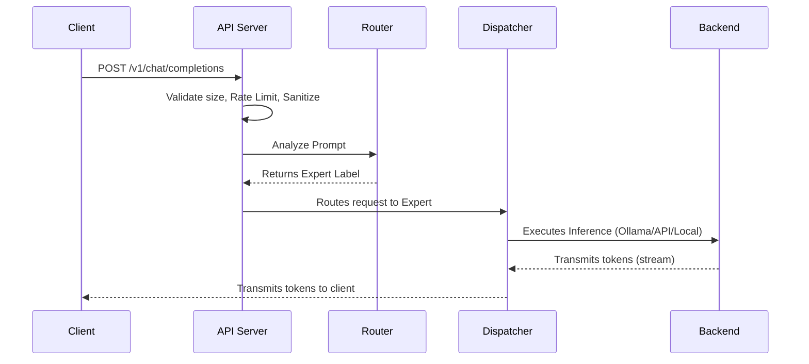
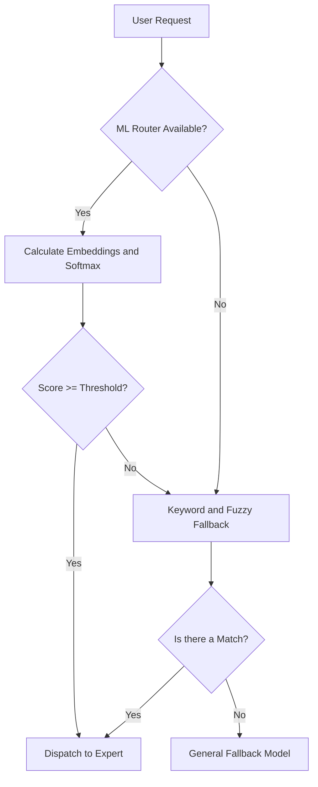
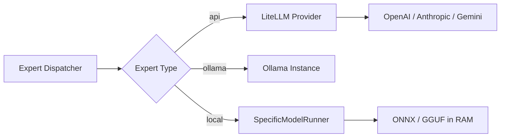

# System Architecture

LEMoE is designed as a modular middleware system. It sits between client applications and the actual AI models.

## High-Level Flow

1. **Client Request**: HTTP to the LEMoE API server
2. **Security and Validation**: size validation, rate limit, sanitization
3. **Routing**: the Router analyzes the prompt and determines the expert
4. **Dispatch**: the Expert Dispatcher forwards to the correct backend
5. **Response**: direct streaming to the client

---

## The Routing Engine (3 levels)

### Level 1: Machine Learning (Main)

Uses text embeddings with `SentenceTransformers` to convert prompts into mathematical vectors and compare them with each expert.

**Hybrid Scoring System** (per expert):
- Pre-calculates individual vectors for each keyword
- Pre-calculates the normalized centroid of all keywords  
- Pre-calculates the vector of the expert's description

On each request, it compares the prompt against these vectors with 4 signals:

| Signal | Default weight | What it measures |
|---|---|---|
| `max_keyword` | 40% | Maximum similarity with any individual keyword |
| `description` | 30% | Similarity with the expert's description |
| `mean_keyword` | 20% | Mean similarity with all keywords |
| `top3_vote` | 10% | Consensus: fraction of top-3 keywords above threshold 0.4 |

Scores are normalized with **Softmax** to obtain a true probability distribution.

### Level 2: Keyword and Fuzzy Fallback

If ML is not available or the score is below the `confidence_threshold`, it uses `rapidfuzz`:

- **Exact token overlap**: identical words
- **Fuzzy matching**: partial match for typos or conjugations

### Level 3: General Fallback

If no one passes the fallback threshold, the request goes to the model designated as `"fallback": true` in `experts.json` (usually a general-purpose model).

---

## The Expert Dispatcher

The Dispatcher abstracts the complexity of each backend and instantiates the correct runner according to the expert's `type`.
