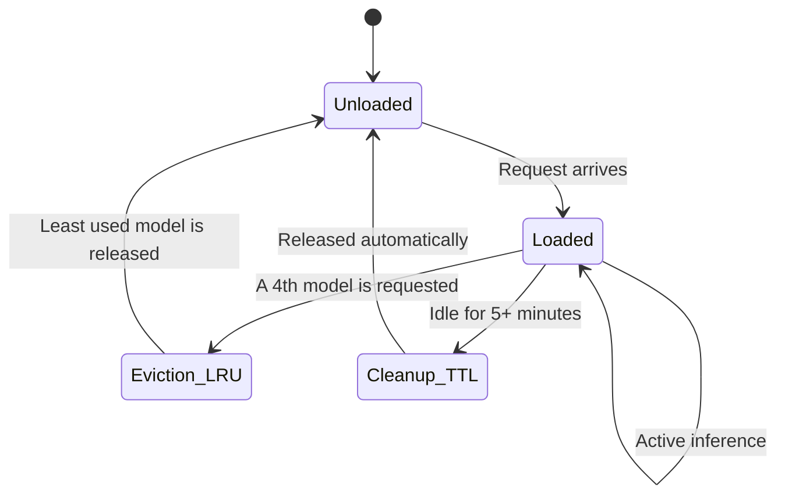

# Memory Management

For local models (`type: "local"`), l3mcore implements an automatic memory manager that prevents RAM exhaustion.

## Model lifecycle



## Maximum loaded models limit

By default, maximum **3 local models** in RAM simultaneously.

```python
# modules/onnx_runner.py
MAX_LOADED_MODELS = 3
```

If a request requires a 4th model and the 3 slots are occupied, the **Least Recently Used (LRU)** is unloaded to free up space.

## TTL (Time To Live)

A background cleanup thread monitors usage. If a model goes **5 minutes without receiving requests**, it is automatically unloaded.

```python
IDLE_TIMEOUT = 300  # seconds (5 minutes)
```

## ONNX thread restriction

By default, each ONNX session is restricted to:
- **2 intra-op threads** (within an operation)
- **1 inter-op thread** (between operations)

This is intentionally low. If each model used all CPU cores and there were 3 simultaneously active models, context-switching would collapse overall performance.

## Parameter tuning

In `modules/onnx_runner.py`:

```python
MAX_LOADED_MODELS = 3   # Increase if you have more RAM (e.g. 32 GB → 8)
IDLE_TIMEOUT = 300      # On Raspberry Pi, lower to 60 to release earlier
INTRA_THREADS = 2       # Increase if you have dedicated CPU and 1 active model
INTER_THREADS = 1       # Usually doesn't need changing
```

:::tip Dedicated hardware
If l3mcore runs on a dedicated server and only one local expert will be active at a time, you can increase `INTRA_THREADS` to 4-8 to improve latency for individual requests.
:::

:::warning Raspberry Pi / limited hardware
Lower `IDLE_TIMEOUT` to 60 seconds and keep `MAX_LOADED_MODELS = 1` for conservative memory usage.
:::
